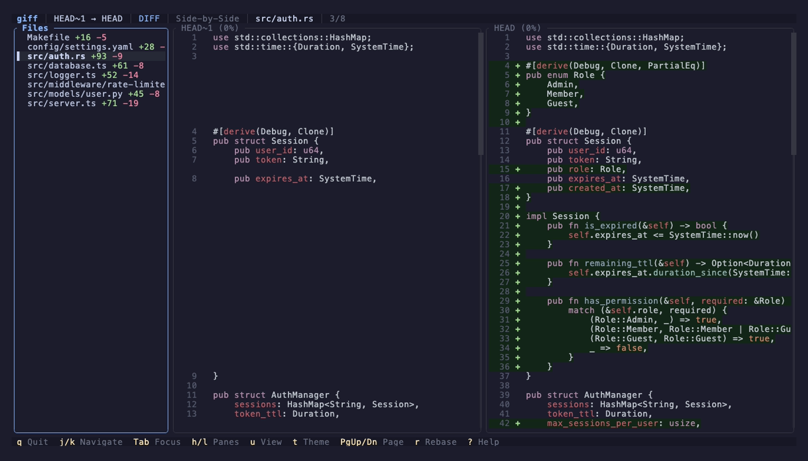
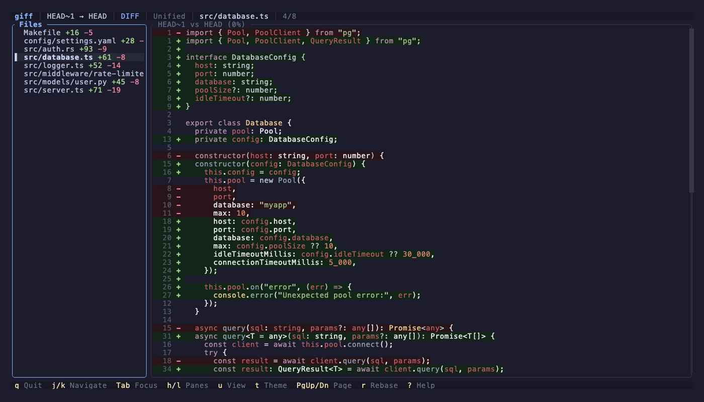
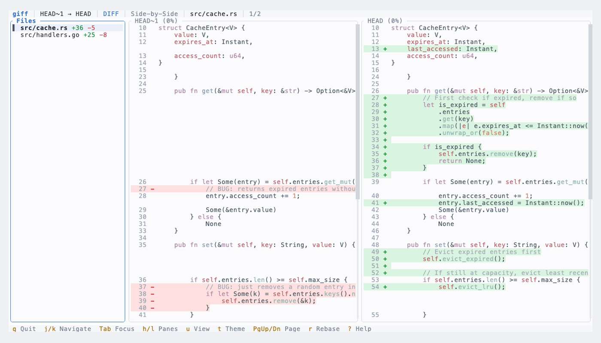
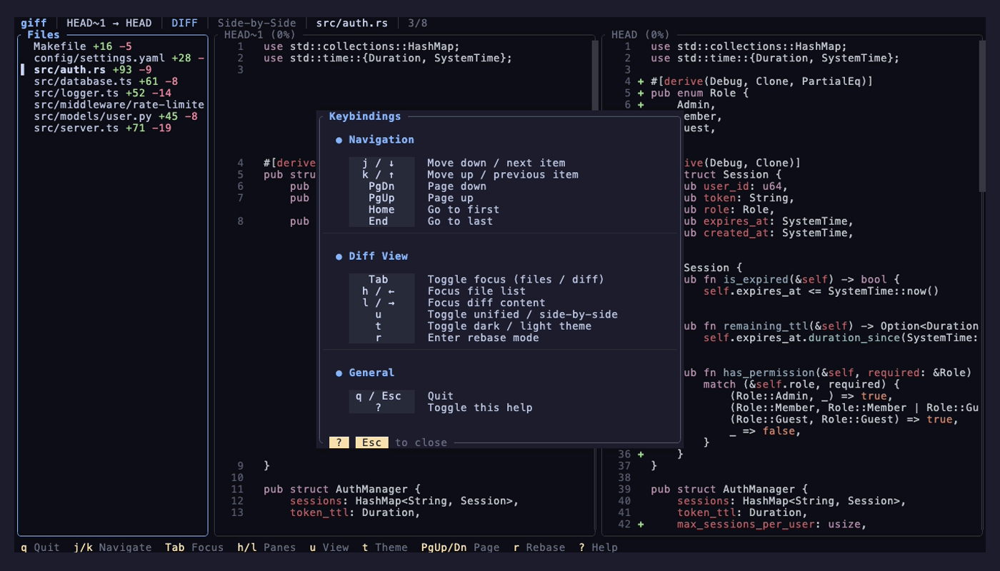

<div align="center">

# giff

**A terminal UI for git diffs with interactive rebase support.**

[](https://github.com/bahdotsh/giff/actions/workflows/ci.yml)
[](https://crates.io/crates/giff)
[](LICENSE)


</div>

---

## Features

- **Side-by-side & unified diffs** — toggle between layouts with a single key
- **Syntax highlighting** — language-aware coloring for 130+ languages via syntect
- **Dark & light themes** — built-in themes with full customization through config
- **Interactive rebase** — accept or reject individual changes, then commit
- **Rebase detection** — notifies you when your branch is behind or has diverged
- **Vim-style navigation** — keyboard-first with mouse scroll support
- **Help overlay** — press `?` anywhere to see all keybindings in context
- **Configurable** — persistent settings via `~/.config/giff/config.toml`

### Syntax highlighting



### Unified view



### Light theme



### Help overlay



## Install

```bash
cargo install giff
```

Or build from source:

```bash
git clone https://github.com/bahdotsh/giff.git
cd giff && cargo build --release
```

## Usage

```bash
giff                        # uncommitted changes vs HEAD
giff main feature-branch    # diff between two refs
giff main                   # diff ref against working tree
giff --theme light          # override theme
giff -d "--stat"            # pass custom git diff args
giff --auto-rebase          # auto-rebase if behind upstream
```

## Keybindings

### Diff mode

| Key | Action |
|---|---|
| `j` / `k` | Navigate down / up |
| `PageDown` / `PageUp` | Page down / up |
| `Home` / `End` | Jump to first / last item |
| `Tab` | Toggle focus between file list and diff |
| `h` / `l` | Focus file list / diff content |
| `u` | Toggle unified / side-by-side view |
| `t` | Toggle dark / light theme |
| `r` | Enter rebase mode |
| `?` | Show help |
| `q` / `Esc` | Quit |

### Rebase mode

| Key | Action |
|---|---|
| `j` / `k` | Next / previous change |
| `a` / `x` | Accept / reject change |
| `n` / `p` | Next / previous file with changes |
| `c` | Commit accepted changes |
| `?` | Show help |
| `Esc` | Cancel rebase |

### Mouse

Scroll wheel works in both the file list and diff panes.

## Configuration

`~/.config/giff/config.toml`

```toml
theme = "dark"

[themes.custom]
base = "dark"
accent = "#89b4fa"
fg_added = "#a6e3a1"
fg_removed = "#f38ba8"
```

See the built-in dark and light themes in [`src/ui/theme.rs`](src/ui/theme.rs) for all available color keys.

## Contributing

Contributions welcome — feel free to open an issue or submit a PR.

## License

[MIT](LICENSE) or [Unlicense](LICENSE), at your option.
